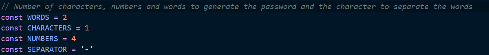

# Easy Password Generator

Password generator that uses a wordlist in combination with numbers and symbols to generate a secure but easy to remember password

## Dependancies

You must have [NodeJS](https://nodejs.org/es/) installed.

## Customizing the password

In order to edit the password parameters, open App.js and change the lines 5 to 8 as prefered.



## Running the script

To run the script, clone the repository and open this folder. Then run the following command to install the dependencies:

```
$ npm install
```

Then run the following command to generate one password, and rerun it until you get one that you like:

```
$ node app.js
```

## Credits

Programmed by: [SoraSpades](https://github.com/SoraSpades)

Idea by: [Kemystra](https://github.com/Kemystra)

You can also refer the git issue for the origin of this idea: https://github.com/josharsh/100LinesOfCode/issues/169
