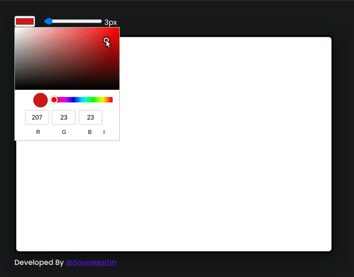

# Responsive Canvas Drawing
This is a simple project built under 100 lines of code. This project enables users to draw on the canvas in the browser and have a lot of features.

## Feature
+ Draw directly in the browser
+ Color picker to pick colors to draw
+ Pencil size picker to change the size of the pencils
  
## Screen Shots

## Live Demo

> live demo here
[https://drawboard.vercel.app/](https://canvas-draw.vercel.app/)
>live codepen demo
[https://codepen.io/saviomartin/pen/yLOZzLb](https://codepen.io/saviomartin/pen/yLOZzLb)

## Total Code
+ 99 lines of code
+ 3007 bytes
+  **42.8%** Javascript, **29.7%** CSS, **27.5%** HTML

## Developer  

> Project By Savio Martin
[@teen_developer on Instagram](https://www.instagram.com/teen_developer/))
### 🌟 this project if found great