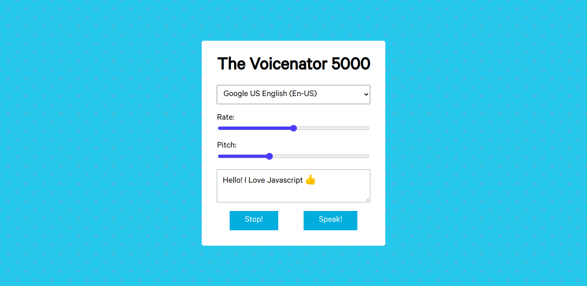

# Speech-Synthesizer

## Live Version : [See here](https://sauravchamoli17.github.io/Speech-Synthesis/)

> Speech Synthesizer uses the Web Speech API in javascript. This interface is used to start the speech, stop the speech, pause it and resume, along with getting the voices supported by the device. Rate and pitch of the voice can also be modulated.

## Author ##

[Saurav Chamoli](https://github.com/sauravchamoli17)

## Credits ##

[Wes Bos](https://github.com/wesbos)
